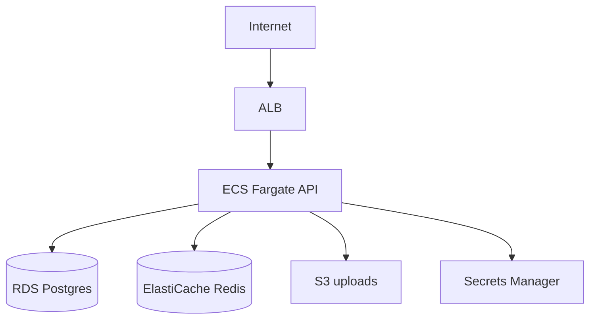

# IPA Worked Example - Node API + Postgres + Redis on AWS (Terraform)

An end-to-end illustration of IPA running the provisioning ritual on one repo. It shows the shape of each artifact and how IDs link discovery to decisions to IaC. Real runs are richer; this is a reference for tone and structure.

The example repo: a TypeScript Express API in a `Dockerfile`, using Postgres (via Prisma) and Redis (sessions), uploading files to S3.

---

## Step 1 - Discover (`discovery/resource_inventory.md`)

```markdown
# Resource Inventory

## Intent (verbatim)
> go through this repo and provision the infrastructure to run it in the cloud

## Mode
- [x] Greenfield (all new infrastructure)

## Discovered resources
### RES-1: HTTP API service
- Type: service
- Evidence: `src/server.ts:10` (app.listen(3000)), `Dockerfile`
- Details: Node 20, Express, listens on 3000, `/healthz` endpoint
- Needs: compute, public ingress, outbound to DB/cache/S3

### RES-2: Postgres database
- Type: datastore
- Evidence: `prisma/schema.prisma`, `DATABASE_URL` env
- Details: Postgres 15, ~10 tables, migrations present
- Needs: managed relational DB, private networking, backups

### RES-3: Redis cache
- Type: cache
- Evidence: `src/session.ts` (ioredis), `REDIS_URL` env
- Needs: managed Redis, private networking

### RES-4: File upload bucket
- Type: object-storage
- Evidence: `src/upload.ts` (@aws-sdk/client-s3), `S3_BUCKET` env
- Needs: object storage + IAM access

### RES-5: Secrets
- Type: secret
- Evidence: `.env.example` (DATABASE_URL, REDIS_URL, JWT_SECRET)
- Needs: secrets store + runtime injection
```

`discovery/dependency_map.md` captures: RES-1 -> RES-2, RES-3, RES-4.

**Gate:** human confirms inventory is correct.

---

## Step 2 - Clarify (questions IPA asked; answers in `decisions/infra_decisions.md`)

```markdown
## DEC-1: Cloud platform
**Decision:** AWS

## DEC-2: IaC tool
**Decision:** Terraform (HCL)

## DEC-3: Environments & tier
**Decision:** dev + prod. Provisioning prod now = production-grade tier (paid SKUs, multi-AZ, backups); dev = basic/cheapest SKUs, single-AZ.

## DEC-4: Region & availability
**Decision:** us-east-1; prod multi-AZ, dev single-AZ; no DR region for v1

## DEC-5: Compute model
**Decision:** ECS Fargate (serverless containers) behind an ALB

## DEC-6: Database
**Decision:** RDS Postgres 15, managed; prod Multi-AZ, 7-day backups

## DEC-7: Cache
**Decision:** ElastiCache Redis, single node dev / replication group prod

## DEC-8: Secrets
**Decision:** AWS Secrets Manager, injected as ECS task secrets

## DEC-9: CI/CD
**Decision:** Yes, generate pipelines - GitHub Actions; rolling deploys via ECS

## DEC-10: State backend
**Decision:** S3 bucket + DynamoDB lock table

## DEC-11: Budget
**Decision:** keep dev < $80/mo; prod < $400/mo target

## DEC-12: Mandatory tags
**Decision:** `Created By` = IPA, `Application` = orders-api, `Environment` = dev|prod (applied via provider default_tags)

## DEC-13: Observability & monitoring
**Decision:** Yes - CloudWatch Logs (30-day retention) + CloudWatch metrics/dashboard + X-Ray tracing; alarm on 5xx rate and ECS CPU, routed to Slack via SNS
```

**Gate:** human confirms decisions.

---

## Step 3 - Plan (`plans/provisioning_plan.md`)

```markdown
## Chosen stack (summary)
AWS, Terraform. ECS Fargate API behind an ALB in a new VPC; RDS Postgres and
ElastiCache Redis in private subnets; S3 for uploads; Secrets Manager for config.
Two environments (dev, prod) with remote state in S3 + DynamoDB.

## Execute steps
- [ ] 1. Target architecture
- [ ] 2. Network & security design
- [ ] 3. Resource specs
- [ ] 4. IaC scaffolding
- [ ] 5. Observability & monitoring
- [ ] 6. CI/CD pipeline
- [ ] 7. Cost estimate
- [ ] 8. Runbook
```

**Gate:** human approves the plan.

---

## Step 4.1 - Target architecture (`architecture/target_architecture.md`)

```markdown
| CR | Cloud service | Satisfies | Shaped by |
|----|---------------|-----------|-----------|
| CR-1 | ECS Fargate service + ALB | RES-1 | DEC-5 |
| CR-2 | RDS Postgres 15 (Multi-AZ prod) | RES-2 | DEC-6 |
| CR-3 | ElastiCache Redis | RES-3 | DEC-7 |
| CR-4 | S3 bucket + IAM policy | RES-4 | DEC-1 |
| CR-5 | Secrets Manager secret | RES-5 | DEC-8 |
| CR-6 | ECR repository | RES-1 | DEC-5 |
| CR-7 | CloudWatch logs/metrics/dashboard + X-Ray + SNS alarm | RES-1 | DEC-13 |
```



---

## Step 4.2-4.3 - Network & specs (excerpt)

```markdown
# Network & Security Design
- VPC 10.0.0.0/16; public subnets for ALB, private subnets for ECS/RDS/Redis across 2 AZs
- SGs: ALB:443 from internet; ECS:3000 from ALB only; RDS:5432 + Redis:6379 from ECS SG only
- IAM: ECS task role limited to the S3 bucket (CR-4) and the secret (CR-5)
- Encryption: RDS/Redis/S3 at rest with AWS-managed keys; ALB TLS via ACM cert
```

```markdown
# Resource Specifications
## CR-1 ECS Fargate: 0.5 vCPU/1GB dev, 1 vCPU/2GB prod; min 1/max 4 on CPU>70%
## CR-2 RDS: db.t4g.micro dev / db.t4g.medium prod, Multi-AZ prod, 7-day backups
## CR-3 Redis: cache.t4g.micro; prod 1 primary + 1 replica
```

---

## Step 4.4 - IaC scaffolding (`iac/terraform/`)

```
iac/terraform/
  modules/
    network/     # MOD-1 -> VPC, subnets, SGs
    compute/     # MOD-2 -> CR-1, CR-6 (ECS, ALB, ECR)
    database/    # MOD-3 -> CR-2 (RDS)
    cache/       # MOD-4 -> CR-3 (ElastiCache)
    storage/     # MOD-5 -> CR-4, CR-5 (S3, Secrets Manager)
    observability/ # MOD-6 -> CR-7 (CloudWatch, X-Ray, SNS alarms)
  envs/
    dev/  {main.tf, variables.tf, terraform.tfvars, backend.tf}
    prod/ {main.tf, variables.tf, terraform.tfvars, backend.tf}
  .gitignore
```

Generated, not applied. Module header example:

```hcl
# MOD-3 Database - provisions CR-2 (RDS Postgres)
# Satisfies: RES-2 | Shaped by: DEC-6
```

Mandatory tags wired once at the provider (DEC-12), inherited by every resource:

```hcl
provider "aws" {
  region = var.region
  default_tags {
    tags = {
      "Created By"  = "IPA"
      "Application" = "orders-api"
      "Environment" = var.environment
    }
  }
}
```

---

## Step 4.6 - Cost estimate (`cost/cost_estimate.md`, prod)

```markdown
| CR | Service | Assumed usage | Est. $/mo |
|----|---------|---------------|-----------|
| CR-1 | Fargate | 1 task, 1 vCPU/2GB, 24x7 | ~$36 |
| CR-2 | RDS t4g.medium Multi-AZ | 24x7 + storage | ~$190 |
| CR-3 | ElastiCache (2x t4g.micro) | 24x7 | ~$25 |
| CR-1 | ALB | 1 ALB | ~$18 |
| CR-4/5 | S3 + Secrets Manager | low volume | ~$5 |
| CR-7 | CloudWatch + X-Ray | logs/metrics/traces, low volume | ~$15 |
| **Total** | | | **~$289/mo** |
```

---

## Step 5 - Validate & hand off

```
terraform fmt -recursive
terraform -chdir=iac/terraform/envs/dev init
terraform -chdir=iac/terraform/envs/dev validate
terraform -chdir=iac/terraform/envs/dev plan      # preview only
```

Traceability check:

```
RES-1 -> CR-1, CR-6 -> MOD-2  (DEC-5)
RES-2 -> CR-2        -> MOD-3  (DEC-6)
RES-3 -> CR-3        -> MOD-4  (DEC-7)
RES-4 -> CR-4        -> MOD-5
RES-5 -> CR-5        -> MOD-5  (DEC-8)
RES-1 -> CR-7        -> MOD-6  (DEC-13)
```

All links resolve. IPA presents the `plan` output and the exact apply command for the human to run:

```bash
terraform -chdir=infra-docs/iac/terraform/envs/dev apply tfplan
```

IPA stops here - the human applies with their own credentials.
