# Skill design improvements

IDE Expert Agents · Plan

This plan compares our MCP agent catalog with published skill-design guidance.
Sources: Anthropic Agent Skills, Perplexity research, Skillgrade / skills-best-practices, Cursor skill authoring, and agentskills.io.
Main goal: MCP-native progressive disclosure.

Track execution in [skill-design-improvements-tasks.md](./skill-design-improvements-tasks.md).

## Contents

1. [Verdict](#verdict)
2. [Industry consensus](#industry-consensus)
3. [What already works](#what-already-works)
4. [Priority 1 — Progressive disclosure](#priority-1--mcp-native-progressive-disclosure)
5. [Priority 2 — Descriptions](#priority-2--description-budget-and-negative-triggers)
6. [Priority 3 — Routing](#priority-3--route-inside-the-agent-do-not-concatenate)
7. [Priority 4 — Scripts](#priority-4--scripts-for-fragile-multi-step-work)
8. [Priority 5 — Evals](#priority-5--evals-first-then-improve)
9. [Priority 6 — Authoring rules](#priority-6--authoring-rules-delta-gotchas-freedom)
10. [Rollout order](#rollout-order)
11. [Work items](#work-items)
12. [Do not](#do-not)
13. [Sources](#sources)

---

## Verdict

The first plan pointed the right way. Industry practice confirms it and adds three hard corrections:

1. **Wrong delivery model.**
   This repo ships **MCP Prompts**.
   `GetPrompt` injects the full body in one shot.
   It does not ship filesystem Agent Skills.
   Industry progressive disclosure uses three tiers: metadata → body → on-demand files.
   If we stop concatenating and tell the agent to “read `references/…` from disk”,
   **npx and Docker fail** — those files are not on the user’s disk.
   Fix: lean prompt + **MCP Resources** (or a fetch tool).

2. **Skip catalog routers for now.**
   Users pick a named prompt with a slash command.
   Wrong auto-trigger is a smaller risk here than in Skills.
   Route **inside** an agent to the right reference file.
   Add store-level routers only after we measure discovery problems.

3. **Measure first. Write gotchas, not encyclopedias.**
   Perplexity and Skillgrade put evals and failure notes before large rewrites.
   Do not rewrite short, procedure-heavy agents without data.

```mermaid
flowchart TB
  subgraph industry [Industry 3-tier Skills]
    Meta["Tier0 name+description ~100 tok"]
    Body["Tier1 SKILL body under 5k tok / 500 lines"]
    Spoke["Tier2 references scripts assets on demand"]
    Meta -->|trigger| Body
    Body -->|conditional read/run| Spoke
  end
  subgraph repoToday [This repo today]
    List["ListPrompts long descriptions"]
    Get["GetPrompt full concat of all *.md"]
    List --> Get
  end
  subgraph repoTarget [MCP-native target]
    List2["ListPrompts dense routing description"]
    Get2["GetPrompt lean core only"]
    Res["MCP Resources / fetch for references/"]
    List2 --> Get2
    Get2 -->|"agent fetches when routed"| Res
  end
```

---

## Industry consensus

| Rule | Sources | Our status |
|---|---|---|
| Load in tiers: metadata → body → spokes | Anthropic, agentskills.io, Perplexity, Cursor, industry case studies | **Broken** — `agents.ts` concatenates every sibling `*.md` |
| Keep the core under ~500 lines / ~5k tokens. Quality drops above ~800 lines | Anthropic, skills-best-practices, Cursor, industry case studies | `iac-generator` serves ~904 lines; several cores sit at 400–458 |
| Treat the description as a **routing key**: WHAT + WHEN + Do-NOT | Perplexity, Cursor, AgentPatterns, industry case studies | Long product blurbs; few Do-NOT lines or hand-offs |
| Pay ~50–100 tokens per skill in the index on every session | Perplexity, Anthropic | ~40 prompts; many descriptions run 300–700+ characters |
| Prefer steps and templates over prose | Industry case studies, Cursor | **Strong** — S# / A# / Step N plus output templates |
| **Run** scripts for fragile multi-step work; do not paste script source into context | Anthropic, industry case studies, AgentPatterns | **Gap** — no `scripts/`; shell steps live in markdown |
| Keep references one level deep from the entry file | agentskills.io, skills-best-practices, Cursor | Flat sibling `.md` files are fine; concat removes the benefit |
| Write only what the model gets wrong (delta / deletion test) | Perplexity, Cursor, industry case studies | Some agents still teach basics the model already knows |
| Grow a Gotchas section from real failures | Perplexity | Few agents ship a Gotchas section |
| Give high freedom for taste and review; low freedom for fragile ops | Cursor | Mixed — some agents over-prescribe git and shell the model already knows |
| Run evals first: pass@k, pass^k, outcome graders, CI | Skillgrade, Perplexity, industry case studies | **Missing** — no eval harness |
| Do not split files unless load behaviour changes | Industry case studies | Compliance and architect agents split for writing, then dump everything at serve time |

---

## What already works

- We use numbered phases and report templates. Keep them.
- We state safety rules clearly (read-only, human approval). Keep them in the lean core.
- Data-platform and pre-sales agents already hand off with “use after X”. Put that language in descriptions too.
- We already exclude `templates/` from concat. Apply the same idea to `references/` and serve them as MCP Resources.

---

## Priority 1 — MCP-native progressive disclosure

**Highest impact.**

**Industry rule:** Load three tiers. Keep spokes out of context until the agent reads them. Scripts return output only.

**Gap:** `mcp-server/src/agents.ts` concatenates every top-level `*.md`. `server.ts` exposes Prompts only. It exposes no Resources.

**Do this:**

1. **Loader.** Serve the entry file only (`agent.md` or `SKILL.md`). Allow optional frontmatter `always_include: [file…]` for tiny must-have snippets.
2. **Layout.** Move deep detail into `references/`. Keep `templates/` for assets. Put a **routing table** in the entry: task signal → resource to fetch. Keep paths one level deep.
3. **MCP Resources.** Register `agent://<name>/references/<file>` (or equal). Claude and Cursor can then fetch under npx and Docker. The core prompt must say “Fetch resource X when…”. It must not assume files exist on the user’s disk.
4. **Pilot.** Start with `devops-agents-store/iac-generator/` (~904 lines today). Then trim one compliance multi-file agent: `eu-ai-act-controls-reviewer` or `agentic-ai-reviewer`.

Do **not** publish a second Agent Skills tree in this phase. Keep one contract. MCP Resources close the gap for this delivery model.

---

## Priority 2 — Description budget and negative triggers

**Industry rule:** Keep the always-on index near ~100 tokens per skill. Write “Load when…”, not a product summary. Use third person, WHAT + WHEN, and trigger phrases. Add Do-NOT lines. Selection accuracy drops after ~20–30 entries without filters.

**Our case:** Slash invoke lowers false auto-trigger risk. `ListPrompts` still sends every description to host UIs. Dense text still wins.

**Do this:**

- Rewrite each description as WHAT + WHEN + one Do-NOT / hand-off. Aim for ~50–100 tokens. Cut workflow restatement.
- Keep quoted user phrases that improve recall.
- Update store and root READMEs when “when to use” changes.

Do not add store-level **router prompts** until evals show users cannot find the right agent among ~40.

---

## Priority 3 — Route inside the agent. Do not concatenate

**Industry rule:** Selective routers cut context by ~60% in published case studies. Perplexity loads accessory files on condition. Anthropic loads spokes on demand.

**Do this** for multi-topic agents only:

- Add a routing section in the core: topic → Resource.
- Forbid “load all modules.”
- Eval that the agent fetches the right accessory file.

Skip catalog-wide routers in this phase.

---

## Priority 4 — Scripts for fragile multi-step work

**Industry rule:** Do not put script source in context. Run the script and use its output. Prefer one script over a long step list. Leave high freedom for taste; use scripts for fragile ops. Do not rewrite git recipes the model already knows.

**Candidates:** `iac-generator`, `dependency-audit`, `delivery-commitment-health-report`, `owasp-security-scanner`.

**Do this:** Add `scripts/` next to the agent. Tell the core to run script X. Expose the script through the package path or an MCP tool. Prefer stdout and artifacts over pasted source. Do not script work frontier models already handle well.

---

## Priority 5 — Evals first, then improve

**Do this early.**

**Industry rule:** Write evals before the skill body. Use Docker runs, deterministic graders, and LLM rubrics. Track pass@k (can it succeed?) and pass^k (does it succeed every time?). Run CI on skill PRs. Use 5–30 trials. Grade outcomes, not transcripts.

**Gap:** We have no agent eval harness. We only keep README sync rules.

**Build this minimum:**

1. Add `evals/<agent-name>/` with tasks, rubrics, and negative / forbidden-neighbour cases.
2. Prefer script and outcome checks. Use an LLM rubric for workflow adherence.
3. Track: with-skill vs bare; correct progressive fetch; false-suggest rate where we can measure it; served token size.
4. Run at least 5 trials. Report pass@k and pass^k for pilot agents.
5. Block agent PRs that touch pilots unless smoke evals pass.

Write evals **before** large content rewrites of the pilots.

---

## Priority 6 — Authoring rules: delta, gotchas, freedom

- **Deletion test.** Ask: “Would the agent get this wrong without this line?” If no, delete it.
- **Gotchas.** Append failure notes. Prefer a gotcha over a longer procedure.
- **Skip the agent** when the model already knows the work, when remote APIs change faster than we can maintain text, or when the rule belongs in project `AGENTS.md` / `CLAUDE.md`.
- **Freedom.** High for UX, taste, and review agents. Low for IaC apply gates and compliance control IDs.
- **Layout.** `agent.md|SKILL.md` + `references/` + `scripts/` + `assets|templates/`. Keep refs one level deep.
- **Budgets.** Description ~50–100 tokens. Core ≤500 lines / ≤5k tokens. Do not serve more than ~800 lines without a written reason.

Add `docs/skill-authoring.md` (or under `mcp-server/`). Point each store’s “Adding an agent” section to it. Update the root README: replace “supporting docs auto-concatenated” with lean prompt + MCP Resources.

---

## Rollout order

1. **Evals + baseline** for `iac-generator` and one compliance agent. Five cases is enough to start.
2. **Loader + MCP Resources.** Stop concat. Make `references/` fetchable.
3. **Pilot trim.** Lean core, routing table, gotchas. Compare against the baseline.
4. **Description pass** across the catalog. Dense text, Do-NOT, hand-offs. Sync READMEs.
5. **Authoring guide** and README architecture update.
6. **Scripts** for fragile multi-step pilots after Resources work.
7. **Later, if needed:** store routers, dual Agent Skills export, Skillgrade-style CI presets.

---

## Work items

- [ ] Stop default concat. Expose `references/` as MCP Resources (or a fetch tool) so npx and Docker work, not only a local clone.
- [ ] Pilot a lean core + `references/` + routing table on `iac-generator`, then one compliance multi-file agent.
- [ ] Rewrite frontmatter descriptions as dense routing signals (WHAT + WHEN + Do-NOT). Target ~50–100 tokens. Sync READMEs.
- [ ] Apply the delta rule and add Gotchas sections. Cut encyclopedic prose.
- [ ] Add a skill-authoring guide for industry tiers and MCP limits. Update the root README architecture.
- [ ] Add minimal evals for pilots first: outcome graders, pass@k / pass^k, negative cases. Run them on agent PRs.
- [ ] Move fragile multi-step flows into `scripts/`. Run for output. Do not dump script source into the prompt.

---

## Do not

- Grow monoliths. More text is not better.
- Split files without changing what loads. That pattern failed in published experiments. We still do it today.
- Tell the agent to “read from disk” without MCP Resources. That breaks npx and Docker.
- Rewrite short, procedure-heavy agents without evals that show failure.
- Write descriptions like documentation. Ignore the index token cost at your peril.
- Over-prescribe shell and git steps the model already knows.
- Add a parallel Skills tree unless the MCP contract stays single-source.
- Add store routers before you measure discovery pain.

---

## Sources

- [Building Skills for AI Coding Agents (industry case study)](https://www.sajeetharan.dev/blogs/building-skills-for-ai-coding-agents/)
- [Anthropic — Equipping agents with Agent Skills](https://www.anthropic.com/engineering/equipping-agents-for-the-real-world-with-agent-skills)
- [Agent Skills specification](https://agentskills.io/specification)
- [Perplexity — Designing, Refining, and Maintaining Agent Skills](https://research.perplexity.ai/articles/designing-refining-and-maintaining-agent-skills-at-perplexity)
- [skills-best-practices](https://github.com/mgechev/skills-best-practices)
- [Skillgrade](https://blog.mgechev.com/2026/03/14/skillgrade/)
- [AgentPatterns — Skill authoring](https://agentpatterns.ai/tool-engineering/skill-authoring-patterns/)
